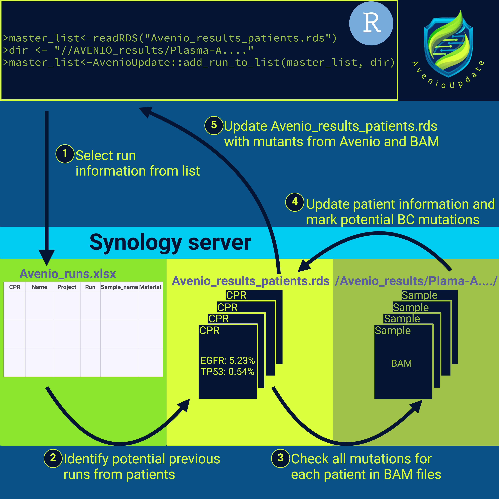

```{r, include=FALSE}
knitr::opts_chunk$set(
    tidy.opts = list(width.cutoff=100),
    tidy = FALSE,
    message = FALSE,
    collapse = TRUE,
    comment = "#>"
)
```
\newpage
# Introduction


This document will describe how to use **AvenioUpdate** to update and explore data
generated with the Avenio pipeline at AUH. The package is dependent on two files
. The first file is an R file (`.rds`) which contains all the Avenio results for 
each sample. This file can be loaded into R where the data is visible. 
The second file is an excel file (`.xlsx`) which contains all the basic
information about the samples run on the NGS machine. Both files are located at
[//Synology_m1/Synology_folder/AVENIO/](//Synology_m1/Synology_folder/AVENIO/)
and will be explained in much greater detail below. 

As of early 2025 the package contains three **main** functions 
(`add_run_to_list()`, `add_new_key()`, & `create_simple_output()`) 
which are used to update the
results file and get an overview of the results for a single patient.
In addition, the package contains six **smaller** functions which are 
used to get some statistics on the data we have collected, to get the 
results for an entire project and to make sure the
results file is updated correctly. 

# Installation

This package is not a *real* package given it is not published at places like
CRAN or Bioconductor. However, it can still be installed via my
[github page](https://github.com/CTrierMaansson/AvenioUpdate) as 
demonstrated below:

```{r setup_github, message=FALSE, results = 'hide', eval = FALSE,R.options = list(width = 100)}
# Only needs to be run once
if (!require(devtools)) install.packages('devtools')

library(devtools)

# Only needs to be run once (Or when the package is updated)
devtools::install_github("CTrierMaansson/AvenioUpdate")

# Needs to be run every time you open RStudio
library(AvenioUpdate)

```

To check if the package has been installed correctly run the following 
command:

```{r testing_installation, message=FALSE, results = 'hide', eval = FALSE,R.options = list(width = 100)}
result_stats_Info()
```

Which should give an output like this:

```{r testing_installation_output, message=FALSE, echo = FALSE,R.options = list(width = 1000)}
library(AvenioUpdate)
library(dplyr)
library(crayon)

result_stats_Info()
```

*Sometimes* installing `devtools` does not configure `git` correctly with 
R and you therefore have to install `git` manually. 

If you use Windows install
git via [https://git-scm.com/downloads/win](https://git-scm.com/downloads/win).
Use the standalone installer 64-bit version. After you have installed `git` test
if git has been installed correctly by opening the terminal. Press the `windows`
bottom on your keyboard and type `cmd` and press enter. In the terminal type 
"git" and press enter. If git has been installed correctly you should see 
"usage: git [-v | --version] [-h | --help] ...". If you do not see this message.
restart your computer and try again. 

If you use Mac install git via 
[https://git-scm.com/download/mac](https://git-scm.com/download/mac) and use
`homebrew` for the installation. Test if `git` has been installed correctly like 
explained above but open the terminal by pressing `cmd` + `space` and type 
Terminal. 

# How it works
As mentioned, the package is dependent on two files located on the 
[Synology](//Synology_m1/Synology_folder/AVENIO/). This means in order to use
the package you must have access to the Synology folder. How to obtain this, 
is found in 
[/Dropbox/Lung cancer group/How-to guides](/Dropbox/Lung cancer group/How-to guides)
. Once you have gained access to the Synology you must stay connected using 
the Ethernet cable connection **IPv4-DNA-server: 10.83.252.137**. 

## The AVENIO_runs.xlsx file
This file is at 
[//Synology_m1/Synology_folder/AVENIO/](//Synology_m1/Synology_folder/AVENIO/)
and contains all the relevant information for all NGS samples across different
projects. 
The file is used to connect CPR numbers and other relevant information with the
NGS results from the Avenio output. By updating and using this file it serves
as a *key*-file allowing type errors, poorly designed sample names,
non-unique sample names across different runs, etc. in the Avenio system and
maintain a consistency across all our projects. Yes! Very neat!

However...

**THIS FILE IS UPDATED MANUALLY**

The file can be opened in excel where the samples can be added accordingly.
It is **VERY** 
important that samples/entries are not deleted from the file. Currently, we
have no backup of the data (given it is sensitive) included in the file. 
If you make errors when entering your information, no worries, this can be fixed
without any repercussions. However, it is very difficult to obtain deleted data.

So as long as you don't delete anything or change entries not belonging to 
you all is fine!

**Nevertheless, there are some rules regarding the file:**

1. **Do not delete anything you are not supposed to**
2. **Do not delete anything you are not supposed to**
3. **Never move the file from its directory** **[//Synology_m1/Synology_folder/AVENIO/](//Synology_m1/Synology_folder/AVENIO/)**
4. **Do not make your own copy of the file and store it locally**
5. **Format the information in the correct format (see below)**
6. **Try to avoid adding samples with incomplete information**
7. **Avoid the use of special characters like **"ÆØŽ#$" **etc. but** "_" **is okay, EXCEPT IN PROJECT AND NAME_IN_PROJECT!**
8. **And do not delete anything you are not supposed to**

### Formatting entries in AVENIO_runs.xlsx

This is an example of some of the entries in the file:
*To ensure no CPR numbers from real patients are displayed, the CPRs here are*
*randomly generated and are therefore "useless"*

```{r, echo=FALSE}
set.seed(9)
readxl::read_xlsx(
  "//Synology_m1/Synology_folder/AVENIO/AVENIO_runs.xlsx",
  col_types = c(rep("guess",4),"date",rep("guess",6))) %>% 
  dplyr::mutate(date_check = lubridate::ymd(Sample_date)) %>% 
  select(CPR,Name_in_project, Project, Sample_date,
         Run_name, Run_ID, Sample_name, 
         Sample_note, Material) %>% 
  na.omit() %>% 
  dplyr::slice(141,337,338,81,82,83,85,581) %>%
  group_by(CPR) %>%
  dplyr::reframe(Name_in_project = Name_in_project,
                 Project = Project,
                 Sample_date = Sample_date,
                 Run_name = Run_name,
                 Run_ID = Run_ID,
                 Sample_name = Sample_name,
                 Sample_note = Sample_note,
                 Material = Material,
                 CPR = paste0(floor(runif(1,10,31)),
                              0,
                              floor(runif(1,1,10)),
                              floor(runif(1,20,100)),
                              floor(runif(1,1000,10000)))) %>%
  knitr::kable() %>% 
  kableExtra::kable_paper(font_size = 12)
```
### Variables in AVENIO_runs.xlsx

#### **CPR**
The CPR number of the patient if such number is known/exists. This number is
unique to every patient and is used to explore the results.
The number is used to extract the information from each patient in 
`create_simple_output()`.

As explained below, AVENIO_results_patients.rds is a named `list` of `data.frames`
where each `data.frame` is named after the CPR number of the patient.

Therefore you will able to explore all Avenio information, including sample
metrics using:

```{r, eval=FALSE,message=F}
# Reading the results file
results <- readRDS("//Synology_m1/Synology_folder/AVENIO/AVENIO_results_patients.rds")

# Extracting the data for a specific patient using the CPR number
results$`<CPR_number>` 
```

**OR**

```{r, eval=FALSE,message=F}
# Reading the results file
results <- readRDS("//Synology_m1/Synology_folder/AVENIO/AVENIO_results_patients.rds") 

# Extracting the data for a specific patient using the CPR number
results[[`<CPR_number>`]] 
```

#### **Name_in_project**

This is the name given to a patient in a project. This name **must** be unique
for the patients within a specific project, but the same name can be used 
across different projects such as *pt26*, *26*, *patient26* etc.
**Because of how the package works **"_" **cannot be included in Name_in_project**

**It is very important** that for a given project a single CPR can only
be assigned to a single Name_in_project. The same CPR can be included in
different projects with different Name_in_project.

If any entry in the file contains "_" in Name_in_project or multiple 
Name_in_project are assigned to the same CPR number,
it will result in an **ERROR**

#### **Project**

This is the project the patient is part of. This is used to group patients as
unique entries. It can also be used to quickly collect the patient information
for your specific project by filtering on the project name.
**Because of how the package works **"_" **cannot be included in Project**

If any entry in the file contains "_" in Project, it will result in an **ERROR**

To include a new project run: `add_new_key()` (see below) and to see current 
included projects run: 
`readRDS("//Synology_m1/Synology_folder/AVENIO/AVENIO_keys.rds")`

#### **Sample_date**

This is the date of the sample collection. **It is important to format the**
**date correctly**. The date should be formatted as `YYYY-MM-DD`. It happens
often that the sample dates for buffy coat (BC) and baseline (BL) samples
are identical. This is not an issue as long as the **Material** column is also
filled out correctly.

When the data is collected and analyzed the algorithm checks the format of 
the date and if it is not correct it will result in an **ERROR**

#### **Sample_number**

This is number corresponding to the blood sample. This is not used by the code
but it can be useful to connect sample dates and sample numbers. 
If the number is unknown you can just write "Unknown".

#### **Run_name**

This is the name of the run as it appears in the Avenio system. While this name is 
not used specifically in the algorithm it is good to have the name in the file
to have a record of which Run_name matches which Run_ID.

#### **Run_ID**

This is the name of the Run_ID which is randomly generated by the Avenio system.
This is an important ID because it is the name of the folder where the results
from Avenio are located on the Synology server. The Run_ID is always 24 
characters long and starts with an "A". If the algorithm detects a Run_ID that
is not 24 characters long it will result in an **ERROR**

#### **Sample_name**

This is the name of the sample as it appears in the Avenio system. This name 
is only unique to the specific run and is used in the algorithm to extract the
BAM files. The algorithm tests if the specific run contains a folder with the
specific Sample_name and if it cannot find a folder with the specific 
Sample_name it will result in an **ERROR**.

#### **Sample_note**

This is a note that can be added to the sample and it is not used in the
algorithm. However, it is nice to include to get a quick overview of the samples
that have been analyzed for the specific patient. In general the variable refers
to time of blood sampling in relation to treatment initiation.
There is no limitation on what can
be included in this column although new possible entries has to be added with 
`add_new_key()` 

To see current included Sample_notes run: 
`readRDS("//Synology_m1/Synology_folder/AVENIO/AVENIO_keys.rds")`

#### **Material**

**This is a mandatory column**. The variable refers to the source of the material
analyzed. In most cases this is "cfDNA" or "BC" which reflects purified plasma
cfDNA or DNA from PBMCs, respectively. Other sources include "size_selection" or
"cfChIP". This is a mandatory column because it allows the same blood sample
(same Project, Name_in_project, Sample_date) to be analyzed multiple times. If
Material is not filled out the algorithm will result in an **ERROR**.

**The classification of "BC" samples is important because non-BC samples from a
patient have variants "flagged" according to the variants detected 
in the BC sample.**

*reanalyze* has been added as a type of Material. This is used when a sample has
been analyzed more than once. This can be used to discriminate between the two 
analyses which would otherwise have the same Project, Name_in_project, and
Sample_date. 

There is no limitation on what can
be included in this column although new possible entries has to be added with 
`add_new_key()` 

To see current included Materials run: 
`readRDS("//Synology_m1/Synology_folder/AVENIO/AVENIO_keys.rds")`

## The AVENIO_results_patients.rds file

This is the other important file located at 
[//Synology_m1/Synology_folder/AVENIO/](//Synology_m1/Synology_folder/AVENIO/),
however this file is **NOT** updated manually by opening and editing it. Instead,
this file is updated automatically by the algorithm when `add_run_to_list()`
is executed.
This means, when you have updated the AVENIO_runs.xlsx file with new 
samples and you want to update the results, you run the following:

```{r, eval=FALSE,message=F}
# Reading the results file
results <- readRDS("//Synology_m1/Synology_folder/AVENIO/AVENIO_results_patients.rds") 

# Example path to the specific run
test_path <- "//Synology_m1/Synology_folder/AVENIO/AVENIO_results/Plasma-ANei_Hsi__lGmaJ1k_Ji_d3O" 

# Updating the results file
results <- add_run_to_list(master_list = results, 
                           Directory = test_path)
```

Then `results` will contain all of the information from the 
AVENIO_runs.xlsx file and AVENIO_results_patients.rds has been updated accordingly.

### More technical note on AVENIO_results_patients.rds (**Not mandatory read**)

AVENIO_results_patients.rds is an `.rds` file which means it is a saved R object.
The file therefore cannot be explored outside of R. However, the file can be
loaded into R where the data is visible. 
The file is a named `list` of `data.frames`
where each `data.frame` is named after the CPR number of the patient.

All the information from the Avenio system is stored in the `data.frames` which
is extracted from the filtered variants located in the `.csv` files. If no 
variants have been detected for the sample, all of the other sample metrics such
as the median depth, fragment length, base quality, etc. are still stored in the
the `data.frames`.
This is also to register that the sample has been analyzed and if other samples 
with detectable variants have been analyzed for that patient these variants are
being investigated in the original BAM files for the patient.

# Main functions

## `add_run_to_list()`

As mentioned, this is the most important function in the package.
The function is used to update the AVENIO_results_patients.rds file with any
new information from the AVENIO_runs.xlsx file. 

### How it works

How the function works is illustrated below:

```{r, echo=FALSE, fig.cap="Fig 1. Illustration of how `add_run_to_list()` works by mergnig information from different files", out.width='80%'}

```

The function takes two mandatory arguments:

1. `master_list` which is the AVENIO_results_patients.rds loaded in using `readRDS()`
2. `Directory` which is the **complete** path to the specific run on the Synology server

And one optional argument:

1. `synology_path` which is the path to the Avenio_runs.xlsx and AVENIO_results_patients.rds files. (Default: "//Synology_m1/Synology_folder/AVENIO/") 

As illustrated in the figure above the function will extract the relevant 
information from the AVENIO_runs.xlsx file. Then it will look through the 
established results on all the patients (using the CPR numbers) and collect the
new run with previous runs from patients in the new run. Then it will take all 
the identified mutations for each patient and look for that mutation in all BAM
files generated for the patient. After this, if a BC sample exists for the patient,
all mutations identified in the non-BC samples are flagged as BC mutations if
they are found the BC sample as well. Then the results dataset is updated with 
the new runs and existing runs are updated after the BAM files have been
reanalyzed. 

#### `sample_index` (**Not mandatory read**)

The variable `sample_index` is created for all samples when `add_run_to_list()`
is executed. The essential idea behind this variable is to combine the most
basic information about an analyzed sample and create a unique and consistent
name for that sample. The `sample_index` naming is inspired by the naming
strategy created by Lærke, which is explained in more detail on dropbox at
[/Dropbox/Lung cancer group/How-to guides/How to navngiv patientprøver.pptx](/Dropbox/Lung cancer group/How-to guides/How to navngiv patientprøver.pptx)

The `sample_index` is created using the AVENIO_runs.xlsx file using the 
following variables:

1. Project
2. Name_in_project
3. Sample_date
4. Material

And the following code:

```{r,eval=FALSE,message=FALSE}
# Reading the AVENIO_runs.xlsx file
df <- readxl::read_xlsx("//Synology_m1/Synology_folder/AVENIO/AVENIO_runs.xlsx", # path to file
        col_types = c(rep("guess",4), #Ensuring correct formatting of dates
                      "date",
                      rep("guess",6)))

#
#
#
###SOME ADDITIONAL CODE NOT RELEVANT FOR THIS MANUAL####
#
#
#

df <- df %>% 
  dplyr::mutate(
    sample_index = paste0(
      Project, #Add project information
      "_",
      Name_in_project, #Add patient ID in project
      "_",
      substr( #Formatting date information
        stringr::str_split_i(as.character(Sample_date), "-",1),3,4), #Adding year information
      stringr::str_split_i(as.character(Sample_date),"-",2), #Adding month information
      stringr::str_split_i(as.character(Sample_date),"-",3))) %>%  #Adding date in month information
  dplyr::mutate( #Formatting material information
    sample_index = ifelse(
      Material != "cfDNA", # Selecting samples NOT cfDNA
      paste0(sample_index,"_",Material), # Adding material if NOT cfDNA
      sample_index)) # Skipping material addition if material is cfDNA
```

As can be seen above the `sample_index` is formatted as
**Project_Name_YYMMDD_(Material)**.

The material is only added if the material is **not** "cfDNA".

The idea behind `sample_index` is to create a quick understanding of the sample
origin and put different samples into a time perspective. 

`sample_index` is exported as a variable in `create_simple_output()` as 
explained below to give the best sample context. 

### Output

The output of the function is the updated results `master_list` 
(named `list` of `data.frames`). This is automatically
saved as the AVENIO_results_patients.rds file and now

```{r,eval=FALSE,message=FALSE}
# Reading the results file
results <- readRDS("//Synology_m1/Synology_folder/AVENIO/AVENIO_results_patients.rds") 
```

Means `results` now contain the Avenio results updated with the
most recent samples.

### Example

An example of how the function is used is shown below:

```{r, eval=FALSE,message=F}
# Reading the results file
results <- readRDS("//Synology_m1/Synology_folder/AVENIO/AVENIO_results_patients.rds") 

# Example path to the specific run
test_path <- "//Synology_m1/Synology_folder/AVENIO/AVENIO_results/Plasma-ANei_Hsi__lGmaJ1k_Ji_d3O" 

# Updating the results file
results <- add_run_to_list(master_list = results,
                           Directory = test_path)

```

### End messages

Several messages are printed during the execution of the function. However, 
for everyday use only the last few messages are of importance. An example 
of this could be:

```{r, echo=FALSE,message=TRUE}
message("1")
message("Before the dataset consisted of 223 individuals and 572 samples analyzed")
message("2")
message("Now the dataset consists of 223 individuals and 586 samples analyzed")
message("3")
message("The following projects have been updated with this many samples")
tibble(Project = "MonAlec",n = 14)
message("4")
message("And the following samples have been added to the dataset")
c("MonAlec_83Z7BF2N4Y12L933_200723_BC",
  "MonAlec_YZ0PPZ1A5JLCB27C_220211_BC",
  "MonAlec_K6YFO3FWXOFI99UZ_201123_BC",
  "MonAlec_CQHQ4QA5K295LU8D_190911_BC",
  "MonAlec_B14Q10RS3BRU807A_210304_BC",
  "MonAlec_6KYRWVT7W2KW1U48_220208_BC",
  "MonAlec_PQ9NESTYL82NBF9B_200813_BC", 
  "MonAlec_UE2R8PRMAT4T3IXD_190611_BC",
  "MonAlec_2UCZEDI4F35T6ILM_200728_BC", 
  "MonAlec_IT8BJVO03C08FV04_191002_BC", 
  "MonAlec_YBNHFHWVB0HBC3YY_200115_BC", 
  "MonAlec_9Y6DEL9FY4T37CX7_201202_BC",
  "MonAlec_4OOA9FR46IB4BXBJ_191101_BC", 
  "MonAlec_FDEDCZO3IR8TENC0_211119_BC")
message("5")
message("Saving updated list of patients")

```

1. The first message explains how many individuals and samples the dataset
consisted of before the addition of the new run
2. The second message explains how many individuals and samples the dataset 
consists of after the addition of the new run
3. The third message explains which projects have been updated and how many
samples have been added to each project
4. The fourth message prints the `sample_index` (see above) 
that have been added to the dataset
5. The fifth message explains that the updated list of patients has been saved

**It is good practice to look through these messages after `add_run_to_list()`**
**has been executed, to make sure the data has been updated as expected.**

## `add_new_key()`

This is the second **main** function of the package and is used to add new 
possible entries to the Project, Sample_note, and Material columns in the 
AVENIO_runs.xlsx file. This step is included to ensure typos are spotted 
so you don't accidentally assign a wrong e.g. project name to a sample. 

The function takes two mandatory arguments

1. `key` which is the key name you want to add as possible entry
2. `variable` which is the variable name in the AVENIO_runs.xlsx you want to add the key to.

And one optional argument:

1. `synology_path` which is the path to the Avenio_runs.xlsx and AVENIO_results_patients.rds files. (Default: "//Synology_m1/Synology_folder/AVENIO/") 

Current included entries for Project, Sample_note, and Material can be viewed
with:

```{r, eval=FALSE,message=F}
readRDS("//Synology_m1/Synology_folder/AVENIO/AVENIO_keys.rds")

```

### Output
There is no output of this function, just a message telling you what variable
has been updated with the new key

### Example

An example of how the function can be used

```{r, eval=FALSE,message=F}
add_new_key(key = "test",
            variable = "Project")

```

This should print the following messages

```{r, echo=FALSE,message=T}
key <- "test"
variable <- "Project"
message(paste0("Adding the new key: '",key,"' for the variable: '",
                       variable,"'."))
message("DONE!")

```

## `create_simple_output()`

This is the third **main** function of the package and is used to get a quick 
overview of a specific patient. The function takes two **mandatory** arguments:

1. `df_list` which is the AVENIO_results_patients.rds loaded in using `readRDS()`
2. `CPR_number` which is the CPR number of the patient you want to investigate

And two optional argument:

1. `synonymous` which is a logical variable that determines if synonymous mutations should be included in the output. (Default: `TRUE`)
2. `synology_path` which is the path to the Avenio_runs.xlsx and AVENIO_results_patients.rds files. (Default: "//Synology_m1/Synology_folder/AVENIO/") 

### Output

The output is a `list` with two entries. The first entry is just the CPR number
to understand which patient the information is gathered from. 
The second entry is a `data.frame` with the following 14 variables where each row
is a gene mutation detected in the patient:

1. **sample_index** - Unique for each sample and is explained above
2. **Class** - Classification of the mutation (FUSION,INDEL,SNV)
3. **Gene** - The gene where the mutation is located
4. **AA** - The amino acid change
5. **Description** - Description of the mutation e.g. missense
6. **Flags** - Flags for the mutation (detailed below)
7. **MAF** - The mutational allele fraction
8. **Variant_depth** - The number of identified reads with the variant
9. **Unique_depth** - The number of unique reads on the position of the variant
10. **Analysis** - Name of the sequencing run in the Avenio system
11. **Sample.ID** - Name of the sample in the Avenio system
12. **Sample.note** - Note of the sample in the AVENIO_runs.xlsx file (BL, Tx, BC, Unknown)
13. **Material** - Material of the sample in the AVENIO_runs.xlsx file (cfDNA, BC, size_selection, cfChIP)
14. **Notes** - Any notes manually added in the AVENIO_runs.xlsx file

If no mutations are detected in a sample for a patient the run is still added
but Gene, AA etc. variables just contain NA. 

For now which variables are included in the output is set to these specific
variables. However, upon request I will look into ways to modify the output 
so the many variables in the Avenio `.csv` files also can be extraced in this 
simple format.

### Example

An example of how the function is used is shown below:
*Again, the CPR number is not a real CPR number*

```{r, eval=FALSE,message=F}
# Reading the results file
results <- readRDS("//Synology_m1/Synology_folder/AVENIO/AVENIO_results_patients.rds") 

# Extracting the simple output
overview <- create_simple_output(df_list = results,
                                 CPR = "1401362941",
                                 synonymous = F)

# CPR number
overview[[1]] 

# Data.frame with the 14 variables
overview[[2]] 

```

Which gives the following output:

```{r, echo=FALSE,message=FALSE}
results <- readRDS("//Synology_m1/Synology_folder/AVENIO/AVENIO_results_patients.rds") 
overview <- create_simple_output(df_list = results,
                                 CPR = "0106482071",
                                 synonymous = F)
overview[[1]] <- "1401362941"

overview[[1]]

overview[[2]] %>%
  knitr::kable() %>% 
  kableExtra::kable_paper(font_size = 12)
```

### Flags

The **Flags** variable is included to give some context on the mutation. 
If the mutation is not not found in the Avenio system, but only found when 
the BAM file is anlyzed the flag is set to "BAM". Then, the **MAF** and 
**variant depth** is also determined from the BAM file, whereas the standard
MAF and variant depth is determined from the Avenio system.

If a mutation is found in a BC sample and the identical mutation
is also found in a non_BC sample the flag is set to "BC_mut" in 
the non_BC samples. This happens irrespective if the mutation is only found
in BAM files from the BC or non_BC samples. 
**Therefore, please be aware that mutations found with as little as one read**
**in the BC sample will be flagged as BC_mut in the non_BC samples, also when**
**the mutation is not detected by Avenio.**

# Small functions (**Not mandatory read**)

As explained above, I have created some functions which can be used to explore
the datasets a bit more. These functions are not mandatory to use but can be
useful in order to get an overview of the projects, samples, runs, etc. 

## `included_analyses()`
This function is used to get an overview of the runs from AVENIO_runs.xlsx that
are included in the results dataset. 

The function takes one mandatory argument:

1. `master_list` which is the AVENIO_results_patients.rds loaded in using `readRDS()`

### Output

The output is a named `list` of lengths = 2.
The first entry ("Overview:") is a `data.frame` with three variables:

1. **Analysis.ID** - The run ID from the AVENIO_runs.xlsx file
2. **n** - Number of samples from that run that are included in the results dataset
3. **Analysis.Name** - The name of the run in the Avenio system

The second entry ("Details:") is a named `list` of `data.frames` where each 
`data.frame` is named with the run ID. 
Each `data.frame` contains four variables:

1. **sample_index** - Unique for each sample and is explained above
2. **Sample.ID** - Name of the sample in the Avenio system
3. **Analysis.Name** - The name of the run in the Avenio system
4. **Analysis.ID** - The run ID from the AVENIO_runs.xlsx file

Available entries can be shown using the following:

```{r, eval=FALSE,message=F}
results <- readRDS("//Synology_m1/Synology_folder/AVENIO/AVENIO_results_patients.rds")
analyses <- included_analyses(results)
names(analyses[["Details:"]])
```

**OR**

```{r, eval=FALSE,message=F}
results <- readRDS("//Synology_m1/Synology_folder/AVENIO/AVENIO_results_patients.rds")
analyses <- included_analyses(results)
analyses[["Overview:"]]$Analysis.ID
```

### Example

An example of how the function is used is shown below:

```{r, eval=FALSE,message=F}
# Reading the results file
results <- readRDS("//Synology_m1/Synology_folder/AVENIO/AVENIO_results_patients.rds")

# Extract included analyses
analyses <- included_analyses(results)

# Getting an overview of the analyses
analyses[["Overview:"]]

```

Which should result in something like this:

```{r, echo=FALSE,message=F}
# Reading the results file
results <- readRDS("//Synology_m1/Synology_folder/AVENIO/AVENIO_results_patients.rds")

# Extract included analyses
analyses <- included_analyses(results)

# Getting an overview of the analyses
analyses[["Overview:"]] %>% 
  dplyr::slice(23:28) %>%
  knitr::kable() %>% 
  kableExtra::kable_paper(font_size = 12,full_width = F)

```

And the second entry is viewed using:

```{r,eval=FALSE,message = FALSE}
# Reading the results file
results <- readRDS("//Synology_m1/Synology_folder/AVENIO/AVENIO_results_patients.rds")

# Extract included analyses
analyses <- included_analyses(results)

# Exploring specific run
analyses[["Details:"]][["AGU232uEYZZKe4oI95IrJu7o"]]
```

Which should result in something like this:

```{r, echo=FALSE,message=F}
# Reading the results file
results <- readRDS("//Synology_m1/Synology_folder/AVENIO/AVENIO_results_patients.rds")

# Extract included analyses
analyses <- included_analyses(results)

# Getting an overview of the analyses
analyses[["Details:"]][["AGU232uEYZZKe4oI95IrJu7o"]] %>% 
  knitr::kable() %>% 
  kableExtra::kable_paper(font_size = 12,full_width = F)

```

## `extract_project()`

This function is used to extract all the results in a project to be used for
downstream analyses. Because the output is quite large some understanding
of how to explore `data.frames` is required to fully explore the results.

The function takes two mandatory arguments:

1. `df_list` which is the AVENIO_results_patients.rds loaded in using `readRDS()`
2. `project` which is the project name from the AVENIO_runs.xlsx file

And three optional argument:

1. `synonymous` which is a logical variable that determines if synonymous mutations should be included in the output. (Default: `TRUE`)
2. `simple` which is a logical variable that determines if the output should contain all information (`simple = FALSE`, default) or simple output (`simple = TRUE`) which resembles the output from `create_simple_output()`
3. `synology_path` which is the path to the Avenio_runs.xlsx and AVENIO_results_patients.rds files. (Default: "//Synology_m1/Synology_folder/AVENIO/") 

### Output

A `tibble` where each row is a mutated gene and 15 or 89 columns. 14 of the 
columns corresponds to variables explained under `create_simple_output()`.
The output contains 15 columns if `simple = TRUE` where the last variable 
represents the patient CPR. If `simple = FALSE` (default) the output contains
all the variables from the AVENIO `.csv` files coupled to the CPR numbers and
other information from AVENIO_runs.xlsx

### Example

An example of how the function is used is shown below:
*Again, the CPR number is not a real CPR number*.
The output is quite large (many rows) so I have only included 10 rows 

```{r, eval=FALSE,message=F}
# Reading the results file
results <- readRDS("//Synology_m1/Synology_folder/AVENIO/AVENIO_results_patients.rds") 

# Extracting project information
extract_project(df_list = results,
                project = "Pembrolizumab",
                synonymous = FALSE,
                simple = TRUE)
```

Which gives the following output:

```{r, echo=FALSE,message=F}
# Reading the results file
results <- readRDS("//Synology_m1/Synology_folder/AVENIO/AVENIO_results_patients.rds") 

# Extracting project information
extract_project(df_list = results,
                project = "Pembrolizumab",
                synonymous = FALSE,
                simple = TRUE) %>% 
  dplyr::slice(1,2,3,4,5,6,31,32,33,40) %>%
  group_by(CPR) %>%
  dplyr::reframe(sample_index = sample_index,
                 CPR = paste0(floor(runif(1,10,31)),
                              0,
                              floor(runif(1,1,10)),
                              floor(runif(1,20,100)),
                              floor(runif(1,1000,10000))),
                 Class = Class,
                 Gene = Gene,
                 AA = AA,
                 Description = Description,
                 Flags = Flags,
                 MAF = MAF,
                 Variant_depth = Variant_depth,
                 Unique_depth = Unique_depth,
                 Analysis = Analysis,
                 Sample.ID = Sample.ID,
                 Sample_note = Sample_note,
                 Material = Material,
                 Notes = Notes) %>%
  knitr::kable() %>% 
  kableExtra::kable_paper(font_size = 12,full_width = F)

```

## `explore_AVENIO_runs()`

This function is used to get an overview of the AVENIO_runs.xlsx file and
explore the sample entries that have been entered. 
This can be used to get an overview of which samples are missing information, 
which analyses have not been added to the results dataset, etc.

The function takes **NO** mandatory arguments, but takes three optional arguments:

1. `Info` - Name of the information of interest, if `Info = NULL` (default) all information is displayed
2. `silent` - A `Boolean` determining if messages should be displayed. If `silent = FALSE` (default) messages are displayed
2. `synology_path` which is the path to the Avenio_runs.xlsx and AVENIO_results_patients.rds files. (Default: "//Synology_m1/Synology_folder/AVENIO/") 
### Output

A `list` with different information on the AVENIO_runs.xslx (`Info = NULL`)
or the specific object as determined by `Info`.

### Example

Two examples of how the function is used is shown below:

```{r, eval=FALSE,message=F}
# Exploring the AVENIO_runs.xlsx file
results <- explore_AVENIO_runs(silent = TRUE)

# Getting the information of total entries
results$Total_entries

```

Should return:

```{r, echo=FALSE,message=F}
results <- explore_AVENIO_runs(silent = TRUE)

results$Total_entries

```

And:

```{r, eval=FALSE,message=F}
# Getting the information on the samples with all the required information
explore_AVENIO_runs(Info = "Required",
                    silent = TRUE)

```

Should return something like:

```{r, echo=FALSE,message=F}
head(explore_AVENIO_runs(Info = "Required",
                         silent = TRUE)) %>% 
  knitr::kable() %>% 
  kableExtra::kable_paper(font_size = 12)

```

### Output description

The output of the function is a named `list` with different entries. I
have included a function (`explore_AVENIO_runs_Info()`) which displays
a brief explanation of each entry. The function has no mandatory arguments.
To view the explanations run the following command:

```{r, eval=FALSE,message=F}
# Getting explanations for entries in explore_AVENIO_runs()
explore_AVENIO_runs_Info()

```

Should return something like:

```{r, echo=FALSE,message=F}
explore_AVENIO_runs_Info() %>% 
  knitr::kable() %>% 
  kableExtra::kable_paper(font_size = 12,full_width = F)

```

## `result_stats()`

This function is similar to `explore_AVENIO_runs()` but is used to get an
overview of the results dataset. The function 
extracts information from the Avenio_results_patients.rds file and generates
some basic statistics on the dataset.

The function takes **NO** mandatory arguments, but takes three optional arguments:

1. `Info` - Name of the information of interest, if `Info = NULL` (default) all information is displayed
2. `silent` - A `Boolean` determining if messages should be displayed. If `silent = FALSE` (default) messages are displayed
3. `synology_path` which is the path to the Avenio_runs.xlsx and AVENIO_results_patients.rds files. (Default: "//Synology_m1/Synology_folder/AVENIO/") 

### Output

A `list` with different stats on AVENIO_results_patients.rds (`Info = NULL`) 
or the specific object as determined by `Info`.

### Example

Two examples of how the function is used is shown below:

```{r, eval=FALSE,message=F}
# Exploring the results file
results <- result_stats(silent = TRUE)

# Getting the information on all mutations
results$All_mutations

```

Should return:

```{r, echo=FALSE,message=F}
results <- result_stats(silent = TRUE)

head(results$All_mutations,n = 10) %>% 
  knitr::kable() %>% 
  kableExtra::kable_paper(font_size = 12,full_width = F)

```

And:

```{r, eval=FALSE,message=F}
# Getting basic statistics on the NGS results
result_stats(silent = TRUE,
             Info = "Basestats")

```

Should return something like:

```{r, echo=FALSE,message=F}
result_stats(silent = TRUE,
             Info = "Basestats") %>% 
  knitr::kable() %>% 
  kableExtra::kable_paper(font_size = 12,full_width = F)
```

### Output description

The output of the function is a named `list` with different entries. I
have included a function (`result_stats_Info()`) which displays
a brief explanation of each entry. The function has no mandatory arguments.
To view the explanations run the following command:

```{r, eval=FALSE,message=F}
# Getting explanations for entries in result_stats()
result_stats_Info()

```

Should return something like:

```{r, echo=FALSE,message=F}
result_stats_Info() %>% 
  knitr::kable() %>% 
  kableExtra::kable_paper(font_size = 12,full_width = F)

```

# list_rebuild.R (**Not mandatory read**)

**Only if absolutely necessary** on the 
[github page](https://github.com/CTrierMaansson/AvenioUpdate) there is a
file called `list_rebuild.R`. This file is used to rebuild the 
AVENIO_results_patients.rds in the case the file is **lost or corrupted.**

The file only works if the AVENIO_runs.xlsx file is not lost. 

`list_rebuild.R` has to be updated manually alongside AVENIO_runs.xlsx, but
Christoffer will make sure this happens relatively regularly. 

When the entire script has been run you should be able to investigate which
runs (if any) that have not been added to the dataset but are present in the 
AVENIO_runs.xlsx file using:

```{r, eval=FALSE,message=F}
explore_AVENIO_runs(silent = TRUE,
                    Info = "Unincluded_analyses")
```

And you can then use `add_run_to_list()` to add the missing runs to the dataset

\newpage
# Session info (**Not mandatory read**)
It is good practice to include this information in tutorials and manuals to 
ensure reproducibility and for troubleshooting if something does not work.
If your code works, discount this section.

```{r session, echo = FALSE}
sessioninfo::session_info(
    pkgs = "attached",
    include_base = FALSE,
    dependencies = NA,
    to_file = FALSE
)
```